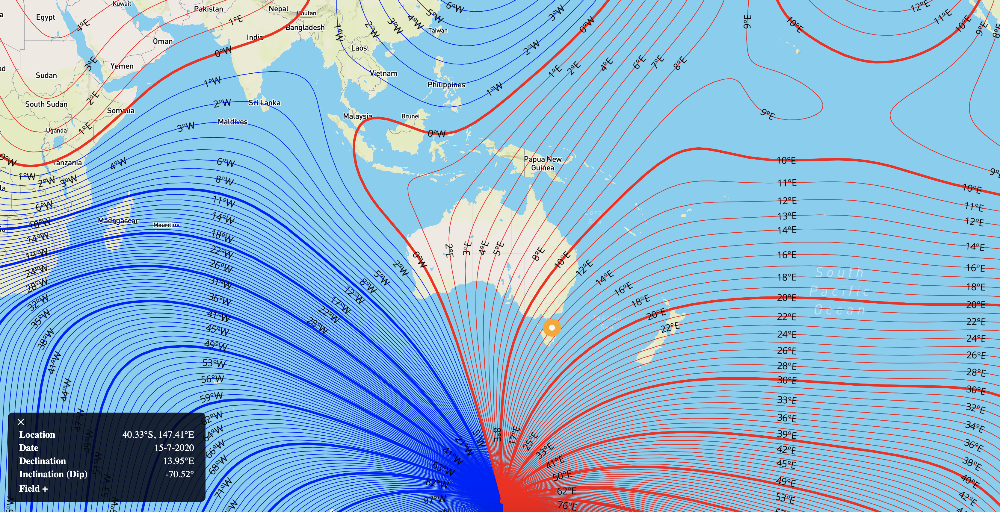
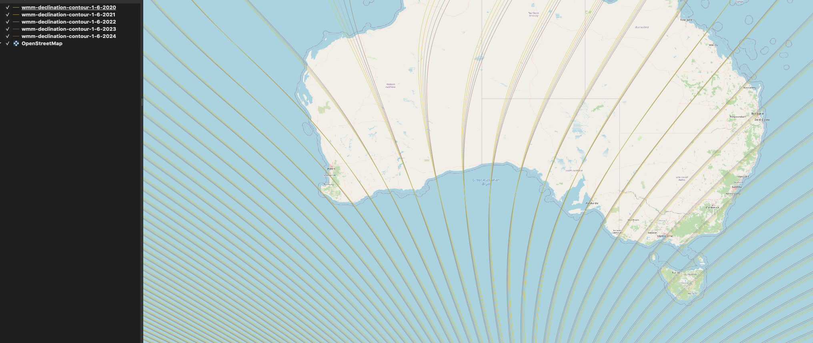

geomag-map
=====

A visualisation of the world magnetic model for 2020-2024 inclusive. Diplayed using mapbox and d3.


Live: [https://geomag-map.herokuapp.com/]

Note: due to the free version of heroku being used, the api endpoint will sleep if inactive for half an hour. The first request to it may be slow (few seconds).

# About 
The earths magnetic field drifts with time. Precise navigation is affected over time
by this drift, to the tune of sometimes 2 degrees every 5 years. The map displays the
current contours and values for magnetic declination to two significant figures, 
calculated using the world magnetic model.




# Installation 
```
npm install 
```

# Data
Data is calculated in the geomag_api repository. A contour file has been generated for each year, which the map will request according to the browsers date.

Detailed clicks send requests to the geomag_api with info about the location & time of the click event. 

# Usage

## Local 
Run the server using
```
npm start 
```
